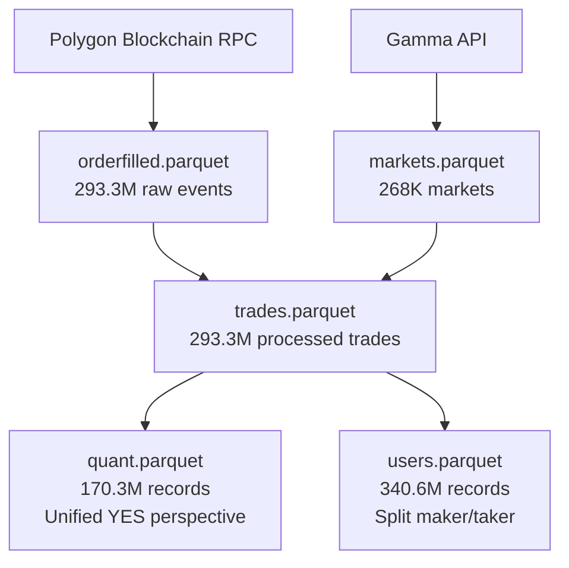

You have two ways to get started. Download the pre-built dataset from HuggingFace if you want historical data immediately with no infrastructure required. Fetch live data yourself if you want an up-to-date copy or want to run the full pipeline on your own machine.

<Tabs>
  <Tab title="Download dataset">
    ## Download from HuggingFace

    The complete dataset is hosted at [SII-WANGZJ/Polymarket_data](https://huggingface.co/datasets/SII-WANGZJ/Polymarket_data) on HuggingFace. You can download individual files or the full 107 GB snapshot.

    <Steps>
      <Step title="Install the HuggingFace CLI">
        ```bash
        pip install huggingface_hub
        ```
      </Step>
      <Step title="Download the dataset">
        Download a single file for a quick start, or all files for the complete dataset.

        <CodeGroup>

        ```bash Single file
        hf download SII-WANGZJ/Polymarket_data quant.parquet --repo-type dataset
        ```

        ```bash All files
        hf download SII-WANGZJ/Polymarket_data --repo-type dataset
        ```

        </CodeGroup>

        <Tip>Start with `quant.parquet` (21 GB) — it is the cleanest file for market analysis and price studies.</Tip>
      </Step>
      <Step title="Load the data">
        Open the file with pandas and start exploring.

        ```python
        import pandas as pd

        df = pd.read_parquet('quant.parquet')

        # Compute per-market statistics
        market_stats = df.groupby('market_id').agg({
            'usd_amount': ['sum', 'mean'],
            'price': ['mean', 'std', 'min', 'max'],
            'transaction_hash': 'count'
        }).round(4)

        print(market_stats.head())
        ```
      </Step>
    </Steps>
  </Tab>
  <Tab title="Fetch live data">
    ## Fetch live blockchain data

    Clone the repository and run the toolkit to pull data directly from the Polygon blockchain. This path gives you up-to-date data and lets you run continuous sync.

    <Steps>
      <Step title="Clone the repository">
        ```bash
        git clone https://github.com/SII-WANGZJ/Polymarket_data.git
        cd Polymarket_data
        ```
      </Step>
      <Step title="Install dependencies">
        ```bash
        pip install -r requirements.txt
        ```

        <Note>Python 3.12 or later is required. See [installation](/installation) for full details including the optional `ALCHEMY_API_KEY` environment variable for faster RPC access.</Note>
      </Step>
      <Step title="Start continuous mode">
        Continuous mode fetches new blocks in real time and keeps all five Parquet files up to date automatically.

        ```bash
        ./scripts/continuous_start.sh
        ```

        This starts a background process that:

        - Fetches 100 blocks at a time when catching up
        - Switches to one block every 2 seconds once synced
        - Writes all four output Parquet files in real time
        - Saves progress so you can restart without data loss

        ```bash
        # Monitor progress
        tail -f logs/continuous_fetch.log

        # Stop gracefully
        ./scripts/continuous_stop.sh
        ```
      </Step>
    </Steps>
  </Tab>
</Tabs>

## How the pipeline works

Data flows from the Polygon blockchain through a series of processing steps to produce the final analysis-ready files:



**Key transformations:**

- `orderfilled.parquet` contains the raw `OrderFilled` events decoded from Polygon logs
- `trades.parquet` joins each event to its market using the token mapping from the Gamma API
- `quant.parquet` filters out contract-to-contract trades and normalises all records to the YES token perspective — 293.3M trades become 170.3M clean user trades
- `users.parquet` splits each trade into two records (one maker, one taker) and converts all directions to BUY with signed amounts, giving 340.6M records sorted by user address

## Next steps

<CardGroup cols={2}>
  <Card title="Continuous mode guide" icon="bolt" href="/guides/continuous-mode">
    Configure and manage the continuous fetching pipeline
  </Card>
  <Card title="Dataset overview" icon="database" href="/dataset/overview">
    Understand the full structure and contents of each file
  </Card>
</CardGroup>
